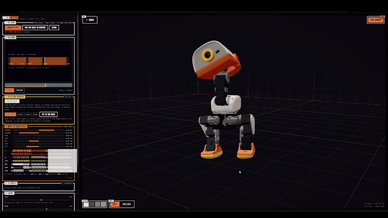

# DuckDance

Drop in a song and a Microduck robot choreographs itself to it. Drop in a
dance video instead and it copies the person in it.



Everything runs in the browser. The file is read from disk, analysed and
turned into robot commands locally; nothing is uploaded anywhere.

Built on [Pollen Robotics' Microduck sandbox](https://huggingface.co/spaces/pollen-robotics/microduck-simulator),
which runs the real robot's trained policies against MuJoCo compiled to
WebAssembly. This repository vendors that Space at revision `1261013` and
adds the dance layer.

## How it works

The simulator never poses the duck directly. It runs a velocity-tracking
policy at 50 Hz, and the only way to steer it is a 13-slot command vector:

| Slot | Meaning |
| --- | --- |
| 0-2 | forward, sideways and turning velocity |
| 3-6 | neck pitch, head pitch, head yaw, head roll |
| 7-12 | body pose, unused by the sandbox's policies |

So "make the duck dance" means writing a plausible twist and head pose for
every 20 ms of the video. The legs stay the policy's business: it works out
how to step, we only say where to go. That division is what keeps the duck
upright while it dances, and it is why there is no keyframe track anywhere
in this repo.

On top of that, moments a gait cannot express are matched to the one-shot
skills the sandbox already ships, and scheduled around how long each one
occupies the duck.

### Three ways to write that command

**Frame by frame** maps every video frame to a command and lets the duck's
rate limiter discard what it cannot follow. It is faithful on a slow clip
and mush on a fast one: on a 125 BPM phone clip the limiter was holding a
channel back on 92% of control steps.

**Phrased**, the default, inverts the problem. Instead of filtering a
signal that is too fast, it builds one that fits by construction.

- The dancer's motion is summarised over a span of whole beats long enough
  for the duck to complete a gesture in, about a second. Each phrase gets
  one target per channel: the net rotation the dancer actually turned
  through, where they travelled. The duck performs that, once, properly.
- Transitions are smoothsteps, whose peak slope is a known 1.5 times the
  average. That is a budget, so when a gesture will not fit, the target
  shrinks and the duck performs a smaller COMPLETE movement rather than
  starting a large one and being cut off.
- The head is not phrased. A full head swing takes 0.4 s against a phrase
  of nearly a second, so it follows the dancer's own rhythm, smoothed only
  as far as needed and then scaled to the largest amplitude that fits.

Measured on the same clip: the phrased track sits exactly on the duck's
slew limits with nothing discarded, the body changes direction 13 times
where the direct path changed 89, and the head keeps 41 of the direct
path's 42 direction changes.

**From the music** needs no dancer at all, and is what a song on its own
gets. The argument for it is the same arithmetic taken one step further:
whatever goes in, the duck manages about one gesture per beat, so a whole
song comes down to a few hundred numbers. A dancer is an expensive way to
produce a few hundred numbers, and every one of them arrives blurred by
tracking noise.

- Figures are written onto a **bar** grid, so they begin on the one. The
  downbeat is found by scoring each candidate phase against how hard the
  beats falling on it are hit.
- A **motif** of two or four bars repeats through a section and is replaced
  at the section boundary, with a busier fill every second repeat. That one
  rule is what separates choreography from a random walk: an audience reads
  a repeated figure as intent. Section boundaries come from a novelty curve
  over per-bar band energy, snapped to four-bar multiples because that is
  where songs actually change.
- Targets are checked against the same slew budget, so the result fits by
  construction with nothing discarded.

The figure library is one small table with an `energy` and a `travel` flag
per entry. It is the only part where taste rather than arithmetic decides,
which makes it the part worth rewriting.

Two measured facts shape that library, and they were not obvious. The gait
has a **threshold**: below about 0.20 m/s forward the policy plants both
feet and leans instead of stepping. And **sideways it never steps at all**,
at any speed the policy allows. So a quiet section asking for 65% of full
size does not get smaller steps, it gets none - which is exactly what an
earlier version did for a whole song, while its head wobbled away.

```
video ──► MediaPipe pose ──► features ──► retarget | phrase ──┐
                                 │                             │
                                 └──────► moves ──► skills ────┤──► 50 Hz track ──► the duck
                                                               │
audio ──► onsets ──► tempo, bars, sections ──► choreograph ────┘
```

### The pieces

| File | What it does |
| --- | --- |
| `capture.js` | Runs the pose tracker over the video, by playback or frame stepping |
| `features.js` | Landmarks to a body basis, head angles, limb and posture signals |
| `retarget.js` | Signals to a 50 Hz command track, frame by frame |
| `phrase.js` | The same, built at a tempo the duck can actually hold |
| `choreograph.js` | Figures written onto the bar grid, from music alone |
| `moves.js` | Kicks, bow, sit and stand, scheduled around the duck's availability |
| `beat.js` | Onsets, tempo, beat grid, downbeat, bars, sections, band energy |
| `stamp.js` | Strictly rising tracker timestamps, per model rather than per clip |
| `player.js` | Video time in, duck commands out |
| `DanceSource.js` | Presents all of that to the sandbox as one more input device |

The sandbox itself is almost untouched. `game.js` gains an input source and
a small API for the player; everything else in `src/game` and `src/ui` is
upstream code.

## Running it

```bash
cd app && npm install && npm run dev
```

Then open http://localhost:5173. Press play with nothing loaded and the
built-in synthetic routine drives the duck, so you can see the whole chain
work before finding a file. Any MP3 or WAV works from there; a video only
matters if you want the duck to copy a particular person.

```bash
npm test
```

Checks the retargeting maths end to end with a synthetic dancer, and the
beat analyser against a synthetic click track. No browser needed.

## Three decisions worth knowing about

**Pose broadcasting is off.** The upstream Space shows other visitors as
translucent ducks, over public relays. There the broadcast pose is whatever
someone is doing with the arrow keys. Here it is derived from a video the
user picked off their own machine, and this app promises that video stays
local. Streaming the choreography read off it to strangers would make that
promise only technically true. Add `?ghosts=1` to turn it back on.

**Clips with no dancer fall back to the music.** Below 15% of frames
tracked, the app will not build a routine out of stray detections - an
earlier version happily did, and the duck spent the whole song holding a
contorted head pose derived from two junk frames. If there is a beat in the
file it is choreographed from that instead, and the app says so.

**Kicks are off in the music path.** The sandbox's kicks are blind one-shot
boots that take no account of the gait they interrupt. Measured on a 40 s
routine: the duck went down 0.2 s after the first kick, and again at every
kick after it. The same routine without them ran the full 40 s with the
trunk never leaving upright. They are one toggle away for anyone who wants
them.

## What works and what does not

Verified: the analysis chain, the command track staying inside the
policy's limits, the duck dancing to the built-in routine, kicks firing
through the sandbox's own skills and being correctly refused while the
duck is busy, tempo recovered from a real MP4 to within 0.1%, and a clip
with no dancer failing cleanly.

**The duck still falls over sometimes**, about three times across the 24 s
built-in routine, usually around a kick. The sandbox's own kicks are
described upstream as blind one-shot boots, so asking for one mid-dance is
inherently a gamble. Fall recovery gets the duck back up on its own and
the routine carries on, with commands held at zero in the meantime.
Turning kicks off in the Moves panel makes the routine stable.

Tracking on real footage turned out fine: a 44 s phone clip of one dancer
came back 100% tracked with the tempo read at 125.7 BPM. What that clip
exposed instead was the speed problem above, and that sit and stand, the
two most expensive skills, crowded every other move out of the routine.

Not verified: tuning across a range of real footage. That needs real
clips, so treat the tuning defaults as a starting point rather than a
finished calibration. The mirror toggle and the per-axis head sign flips
are there because a screenshot settles polarity faster than arithmetic.

Known limits:

- **The duck has no arms.** Most of what a dancer does above the waist has
  nowhere to go, and is redirected into the head and neck.
- **Depth from one camera is weak.** Sideways movement retargets far more
  reliably than movement toward or away from the lens, which is why the
  forward command is mostly driven by step cadence instead.
- **Skills are slow.** A kick occupies the duck for about a second and a
  sit for three, so a fast routine will have moves dropped. The timeline
  shows which, and why.
- **Most dance is too fast for the duck.** A command channel takes about
  0.4 s to swing from one extreme to the other, and a beat at 125 BPM is
  0.48 s. A dancer moving on every beat asks for a full swing and back
  inside one beat, which the duck cannot do, so the slew limiter throws
  most of the motion away and what is left reads as twitching. The Speed
  panel measures this per clip and will fit the playback rate to what the
  duck can actually follow.
- **The beat grid is a constant tempo.** It will not follow a clip that
  speeds up or slows down.

## Where this could go

The command vector is a narrow channel: at most a twist and a head pose. A
genuine imitation policy trained in
[microduck_rl](https://github.com/pollen-robotics/microduck_rl) against
reference motions retargeted from video would drive all 14 joints and could
follow a dancer properly, at the cost of a training run on a GPU. This
repository is the other half of that work: it already produces the
retargeted reference motion such a policy would need.

## Licence and credit

The simulator, the MJCF models and the ONNX policies are from Pollen
Robotics, under the terms of the upstream Space and of
[pollen-robotics/microduck](https://github.com/pollen-robotics/microduck).
Pose tracking uses Google's MediaPipe Pose Landmarker, vendored under
`app/public/mediapipe`.
